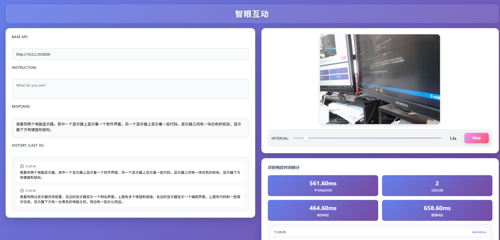

# 项目描述

本项目基于 llama.cpp，旨在为本地开发者提供一个离线的、可扩展的实时视频分析平台。核心思路是通过 llama.cpp 的服务端 API 将本地摄像头捕获的视频流发送给推理模型，返回结果并在前端界面进行显示。系统支持 GPU 与 CPU 两种推理模式，便于不同硬件环境下的部署。

# 主要特性
- 本地运行：无需云端依赖，数据在本地处理，保障隐私。
- 实时视频分析：从浏览器摄像头获取视频流，实时进行推理与分析。
- 双模式推理：支持 GPU 加速与纯 CPU 推理。
- 简易部署：提供可执行脚本 start.sh / start.bat，快速启动应用。
- Web 界面：通过浏览器交互，授权摄像头、启动分析、查看结果。

# 安装与使用指南

## 第一步：下载安装 llama.cpp

从 GitHub releases 页面下载 llama.cpp：
https://github.com/ggml-org/llama.cpp/releases

下载完成后，解压到本地目录。我这里选择了两个版本：
- Windows 版本：`llama-b7728-bin-win-cpu-x64` 目录
- Linux 版本：`llama-b7730-bin-ubuntu-x64` 目录

其他版本请自行下载。

## 第二步：下载模型

由于模型从 huggingface 下载需要科学上网，这里提供百度网盘分享的模型文件：

通过网盘分享的文件：model
链接: https://pan.baidu.com/s/1RMZVaM1eXgj46qOTgrJD6Q?pwd=4zm7 提取码: 4zm7

需要手动把模型下载到 `llama-b7728-bin-win-cpu-x64/model` 目录。

模型文件包括：
- `Qwen2.5-VL-3B-Instruct-Q4_K_M.gguf`：主模型
- `mmproj-Qwen2.5-VL-3B-Instruct-Q8_0.gguf`：视觉模型

## 第三步：启动 llama.cpp 服务

### 使用 GPU 加速（推荐）

以 Windows 为例，进入 llama.cpp 文件夹，运行以下命令：

```bash
cd llama-b7728-bin-win-cpu-x64
llama-server -m model/Qwen2.5-VL-3B-Instruct-Q4_K_M.gguf --mmproj model/mmproj-Qwen2.5-VL-3B-Instruct-Q8_0.gguf -ngl 99 --host 0.0.0.0 --port 8000
```

### 仅使用 CPU

如果仅使用 CPU 推理，请将参数设置为：

```bash
llama-server -m model/Qwen2.5-VL-3B-Instruct-Q4_K_M.gguf --mmproj model/mmproj-Qwen2.5-VL-3B-Instruct-Q8_0.gguf -ngl 0 --host 0.0.0.0 --port 8000
```

### 参数说明

- `-m model/Qwen2.5-VL-3B-Instruct-Q4_K_M.gguf`：指定使用的主模型
- `--mmproj model/mmproj-Qwen2.5-VL-3B-Instruct-Q8_0.gguf`：视觉模型
- `-ngl 99`：使用 GPU 加速（设置为 0 时禁用 GPU，仅使用 CPU）
- `--host 0.0.0.0`：监听所有网络接口
- `--port 8000`：服务端口号

## 第四步：启动应用

根据你的操作系统运行对应的启动脚本：

- **Linux/Mac**：运行 `start.sh`
- **Windows**：运行 `start.bat`

确保 llama-server 已经成功启动后再运行启动脚本。

## 第五步：启动摄像头

1. 打开浏览器后，点击授权使用摄像头
2. 设置每次分析视频画面的时间间隔
3. 点击【start】按钮即可开始分析

## 性能测试

### GPU 性能测试（RTX 2080）



在 RTX 2080 显卡下测试，每次分析时长约 700 毫秒。

### CPU 性能测试（Intel i7 13代）


在 Intel i7 13代 CPU 下运行，每次分析平均 1500 毫秒。

## 常见问题

### Q: 为什么推理速度比较慢？
A: 推理速度取决于硬件配置。GPU 模式下 RTX 2080 约 700ms/次，CPU 模式约 1500ms/次。如需更快速度，建议使用更强的显卡或降低模型量化级别。

### Q: 如何切换 GPU 和 CPU 模式？
A: 启动 llama-server 时，使用 `-ngl 99` 启用 GPU，使用 `-ngl 0` 仅使用 CPU。

### Q: 模型文件应该放在哪里？
A: 模型文件应放在 `llama-b7728-bin-win-cpu-x64/model` 目录下。

### Q: 摄像头权限被拒绝怎么办？
A: 请在浏览器设置中允许摄像头访问权限，或检查系统隐私设置。

## 致谢

- [llama.cpp](https://github.com/ggml-org/llama.cpp) - 高效的 LLM 推理框架
- [Qwen2.5-VL](https://huggingface.co/Qwen/Qwen2.5-VL-3B-Instruct) - 视觉语言模型
- [Hugging Face](https://huggingface.co/) - 模型托管平台

## 许可证

本项目采用 MIT 许可证开源。

## 贡献

欢迎提交 Issue 和 Pull Request！

## 联系方式

- GitHub: [marsoyang1](https://github.com/marsoyang1)
- 项目地址: [localVllm-realtime-webcam](https://github.com/marsoyang1/localVllm-realtime-webcam)
